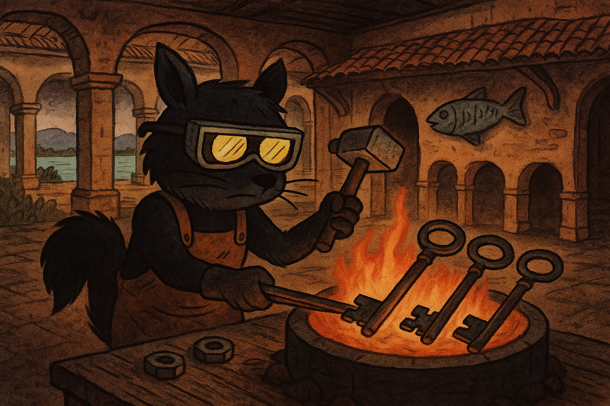

# Reth y Grandine (Rust)

<figure><figcaption></figcaption></figure>

```bash
# 

cd reth/
ls
cargo install --locked --path bin/reth --bin reth
exit
cd reth/
ls
cargo install --locked --path bin/reth --bin reth
reth node
reth node --discovery.port 30304
reth node --port 30304
reth node --discovery.port 30304 --port 30304
reth node --discovery.port 30304 --port 30304 --authrpc.port 8552
ls
screen -S reth
screen -ls
exit
rustup
cargo --version
apt-get install ca-certificates libssl-dev clang cmake unzip protobuf-compiler libz-dev
sudo apt-get install ca-certificates libssl-dev clang cmake unzip protobuf-compiler libz-dev
ls
git clone https://github.com/grandinetech/grandine
cd grandine/
git submodule update --init dedicated_executor eth2_libp2p
cargo build --profile compact --features default-networks
cd
exit
```

<figure><figcaption></figcaption></figure>

